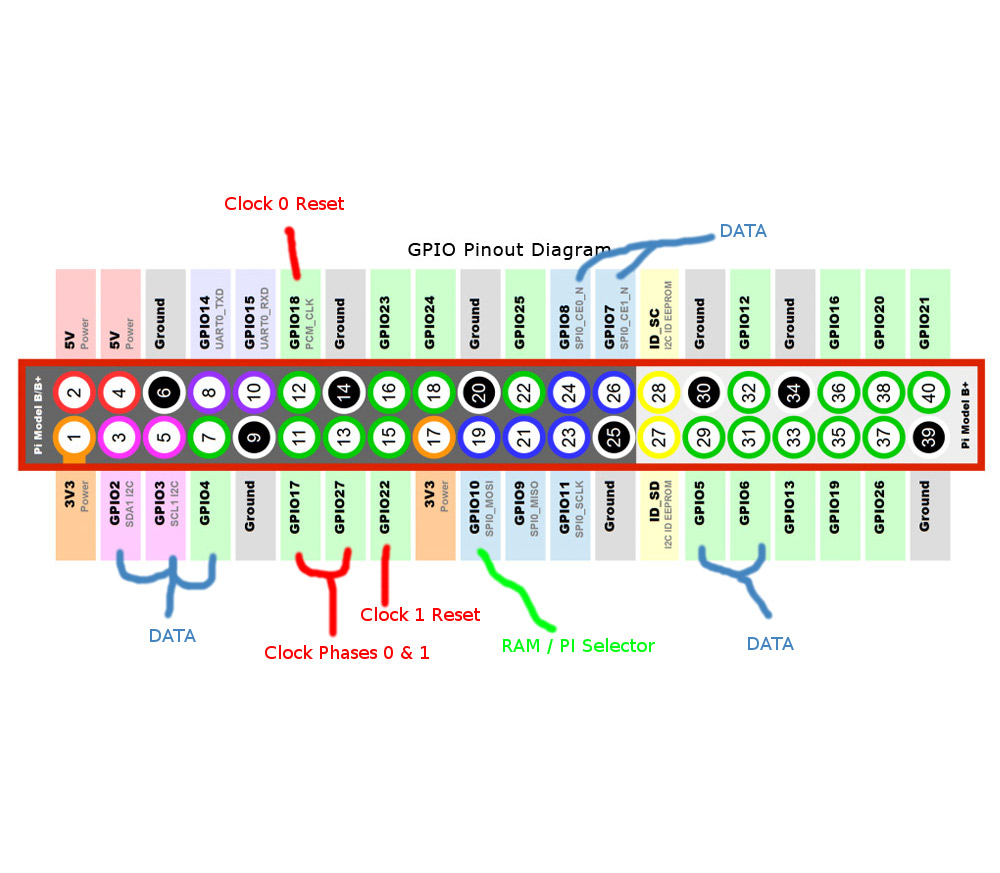

Docs on Big hex project - year 2

Author: Nathan Doorly

## Hardware
 * Raspberry PI 2 (running the webserver, compiling code and driving the clock signals)
 * Briding circuit that allows R-PI GPIO pins to drive build-a-comp signals
 * Build-a-comp boards (comprising the actual machine)
 * LED matrix and driver board
 * Buttons driven by custom circuit

The R-Pi has two wifi connections. One for eduroam and one to create a hotspot for people to connect to. There is no
bridge between the two, since it is not necessary for any work done or users to access. Could also create large security
problems.
The hostspot was created using this doc: https://www.raspberrypi.org/documentation/configuration/wireless/access-point.md

node version: 6.11.0

###Compiing the X compiler
If the compiler gets corrupted or overritten etc. `cd` to compiler directory,
Run all these commands:

`
  make clean
  make
`

## Working on the R-Pi
There are a couple of ways to work on the Pi remotely. First and foremost it has ssh capability so you can
interact through a terminal and git pull any updates that are needed. Do this by connecting to the hotspot
and using:
`
    ssh pi@192.168.0.1
`
Also installed in the R-Pi is 'rmate'. It allows you to ssh in and pull files into atom if you have the package
installed locally. (Package must be activated in the menu). Run the command:
`
    ssh -R 52698:localhost:52698 pi@192.168.0.1
`
And open a file with
`
    rmate examplefile.js
`
see: https://github.com/textmate/rmate

## R-Pi

This is the current layout of the Pi's GPIO Pins and their uses

## Folder Structure

Build:

-Build is created by node-gyp. Using commands 'node-gyp configure' and 'node-gyp build'.
-Don't really need to do much else to it.

Configure:
-Configure is used for any npm packages that need to be configured (who would've guessed?).
-Also used to configure the queue system and api calls
-Other potential packages like sql or Angular should be configured here.

gpioConfig:
-Control of gpio pins from this folder.
-Also contains js portion of compiler and assember. Maybe should be moved in future?
-c++ object created to run on own thread. It maintains control of the clock signal
 and regular data outputs. Needs to be c++ so clock is regular, as JS is single threaded.

public:
-All html, css and browser run js files are in public. It is the front end
-scripts are in resources sub-directory.
-gui is homepage.

routes:
-user_routes is where all http requests from a user are handled.
-If websockets etc added in future, make a weboskcet routes file here to handle it all.

xCompiler:
-David May's x compiler is here rebuilding written above.
-Also contains the old compiler if it is ever needed.
-sim2 and sim3 reside here

xPrograms:
-All programs that can be chosen from the loadprogram page.

serverV2:
+-- build:
    +-- binding.Makefile
    +-- config.gypi
    +-- gpioService.target.mk
    +-- Makefile
+-- Configure:
    +-- api.js
    +-- express.js
    +-- queue.js
+-- gpioConfig:
    +-- build:
        +-- config.gypi
    +-- assembler.js
    +-- compiler.js
    +-- gpioService.js
    +-- gpioService.cc
    +-- myobject.h
    +-- myobject.cc
+-- node_modules:
    +-- Too many to list.
+-- public:
    +-- resources:
        +-- bootstrap.min.css
        +-- bootstrap.min.js
        +-- cookies.js
        +-- jquery.js
        +-- loadassemblyScript.js
        +-- loadProgramScript.js
        +-- scripts.js
        +-- styles.css
    +-- gui.html
    +-- loadassembly.html
    +-- loadprogram.html
    +-- runinstruction.html
+-- routes:
    +-- user_routes.js
+-- xCompiler:
    +-- oldCompiler:
        +-- Previous versions of compiler files. Kept in case of emergency
    +-- All compiler files
    +-- sim2 and sim3 are git ignored
+-- xPrograms:
    +-- all x program files
+-- .gitignore
+-- binding.gyp
+-- package.json
+-- README.txt
+-- server.js

## NPM modules
sleep
bindings
express
node-gyp
hashmap
